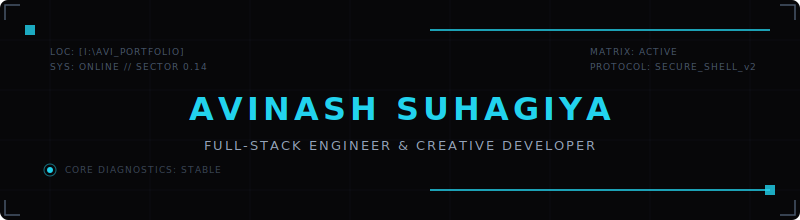

# 🌌 Welcome to the Quantum Grid

  

  

---

### 👽 About Me

I am a Software Engineer and Creative Developer. I design and build highly interactive, immersive web applications, specializing in merging clean code architectures with advanced front-end aesthetics (WebGL, Three.js, and fluid animations).

---

### 🚀 Specialties

| 🎨 Interactive Frontend | 🛡️ Backend & Cloud | 👾 Systems & Tools |
| :--- | :--- | :--- |
| • React / Vite / TS • Three.js (WebGL) • Framer Motion • Tailwind CSS | • Node.js APIs • Python Scripting • AWS Infrastructure | • Git Version Control • Docker Containers • CI/CD Pipelines |

---

### 📂 Featured Project

<table width="100%">
  <tr>
    <td>
      <h3>🌌 <a href="https://github.com/Kratos-avi/Avi_Portfolio">Avi_Portfolio</a></h3>
      
My flagship interactive developer portfolio and physics workstation. Features real-time WebGL mesh warping, telemetry HUD grids, retro games, and a full interactive terminal interface.

      

        
        
        
      

    </td>
  </tr>
</table>

---

### 📊 System Diagnostics (GitHub Stats)

  
  

  

---

### 📡 Network Nodes (Connect)

  
  

